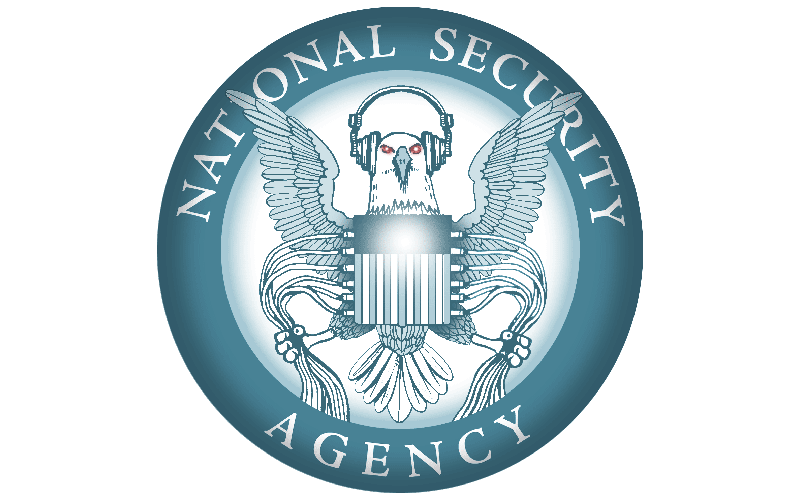

% ACME / Let's Encrypt!
% Peter Mosmans
% 22-07-2015

Contents
========
* What's the **problem** ?

* Current workflow

* The **solution**

* Types of certificate validations

* Let's Encrypt Client

* ACME Protocol

* Let's Encrypt CA

* Caveats


Problem
=======

#####  #####


Why you should use SSL/TLS
==========================
* End-to-end encryption

    * Prevent sniffing (confidentiality)

    * Prevent modification (integrity)

* Validation of domain name (authentication)


Current workflow
================
* Generate RSA public/private keypair
* Generate Certificate Signing Request
* Upload Certificate Signing Request to Certificate Authority
* Pay &#36;&#36;&#36; to Certificate Authority
* Certificate Authority "validates" domain name

##### ...*wait*... #####
 
* Receive certificate
* Manually install certificate
* Backup certificate
* Configure Apache/IIS/NGINX
* **Edit wiki page**

Issues
======

1. &#36;&#36;&#36;
------
2. Difficult/error prone
------------------------

```
openssl req -new -newkey rsa:2048 -nodes -keyout certificate.key \
        -out certificate.csr
SSLCertificateFile "/path/to/www.example.com.cert"
SSLCertificateKeyFile "/path/to/www.example.com.key"
SSLCertificateChainFile "/path/to/chain.cert"
SSLProtocol ALL -SSLv2 -SSLv3
SSLCipherSuite HIGH:!SSLv2:!IDEA:!RC4:!MD5:!ADH:!AECDH:!aNULL:!eNULL
SSLHonorCipherOrder on
```
Result == Not *everybody* likes requesting/configuring/installing/maintaining/revoking/renewing certificates


Solution
=========
1: &#36;&#36;&#36;
---------
Let's Encrypt: A FREE fully automated Certificate Authority

(Will be) trusted by all major browsers

2: Difficult/error prone
------------------------
From http to https in 2 commands:

```
sudo apt-get install lets-encrypt
sudo lets-encrypt everything
```

Wait... WHAT ?
==============
#####  #####

* Simple

* Free (no &#36;&#36;&#36;)

* Automated

* Open (no vendor lock-in)

An initiative of
================

#####    #####
#####    #####


Actually 3 initiatives
======================

* Let's Encrypt client

* ACME (Automatic Certificate Management Environment) Protocol

* Free Certificate Authority


Let's Encrypt client
====================

* Creates public/private keypair

* Creates certificate siging request

* Validates domain name with ACME Certificate Authority

* Obtains signed certificate

* Installs certificate

* **Configures Apache/NGINX**


Let's Encrypt client
====================
Do everything
```
sudo letsencrypt run
```

Request a certificate:
```
sudo letsencrypt -d example.com auth
```

Revoke a certificate:
```
sudo letsencrypt revoke --cert-path example-cert.pem
```

Revoke a key:
```
sudo letsencrypt revoke --key-path example-key.pem
```

Demo
====

Directory structure
===================
* `/etc/letsencrypt`
configuration directory

* `/etc/letsencrypt/accounts`
accounts per ACME Certificate Authority
  (contains account private key)
  
* `/etc/letsencrypt/keys`
contains all private keys
  
* `/etc/letsencrypt/certs`
contains all signed certificates
  
* `/etc/letsencrypt/live`
contains active private keys and signed certificates per domain


On certificate validation
=========================
In order of &#36;&#36;&#36; (and assurance):

* **&#36;**: Domain Validation

* **&#36;&#36;**: Organizational Validation

* **&#36;&#36;&#36;**: Extended Validation

&#36;: Domain Validation
====================
* The CA checks the right of the applicant to use a specific domain name


&#36;&#36;: Organization Validation
===========================
* The CA checks the right of the applicant to use a specific domain name

* "Some vetting" of the organization


&#36;&#36;&#36;: Extended Validation
========================
* The CA checks the right of the applicant to use a specific domain name

* "Thorough vetting" of the organization

    * Legal, physical and operational existence of the entity

    * Identity of the entity matches official records

    * The entity has exclusive right to use the domain specified in the EV SSL Certificate

    * The entity has properly authorized the issuance of the EV SSL Certificate


ACME
====
Protocol to automate domain validation and certificate enrollment

All messges from client to server are signed

All messaging is encrypted using TLS (tcp:443)

Bootstrap issue: client creates self-signed certificate


1/3: Register with ACME server
==============================
Client registers with ACME server:

+ Generate key pair
+ Sign contact information using private key


```
*Client*                                              *Server*

Contact Information
Signature                     ------->
                              <-------            Registration
```

one keypair (account) for multiple domains

2/3: Proof of possession
========================
+ Claim authority over identifier (eg. domain name)
+ Sign identifier using private key

```
*Client*                                             * Server*

Identifier
Signature                     ------->
                              <-------              Challenges
Responses
Signature                     ------->
                              <-------       Updated Challenge

                    <~~~~~~~~Validation~~~~~~~~>

Poll                          ------->
                              <-------           Authorization
```

3/3: Sign certificate
=====================
+ Generate certificate signing request
+ Sign certificate signing request using private key


```
*Client*                                             *Server*

CSR
Signature                    -------->
                             <--------            Certificate
```

Certificate revocation
========================
+ Generate revocation request
+ Sign revocation request using private key


```
*Client*                                             *Server*

Revocation request
Signature                    -------->
                             <--------                 Result
```

Caveats
=======
* No wildcard certificates

* Only domain validated certifcates

* Currently <span class="strike">extremely buggy</span> beta software

* Only support for newer Apache and NGINX

* Not live yet (planned for September 2015)


Conclusion
==========
* Let's encrypt simplifies rollout and management

* ACME CA: A new free Certificate Authority<sup>excellent!</sup>

* BOULDER: Open source ACME CA server -  could be used for other purposes


Thank you for your attention
============================
* [https://letsencrypt.github.io/acme-spec/](https://letsencrypt.github.io/acme-spec/)

* [https://github.com/letsencrypt/](https://github.com/letsencrypt/)

* [https://github.com/PeterMosmans/ansible-role-letsencrypt](https://github.com/PeterMosmans/ansible-role-letsencrypt)


#### *made with ♥ using , , [DZSlides](http://paulrouget.com/dzslides/) and [pandoc](http://pandoc.org)* ####

#### www.onwebsecurity.com // **peter.mosmans@go-forward.net** // www.go-forward.net ####

